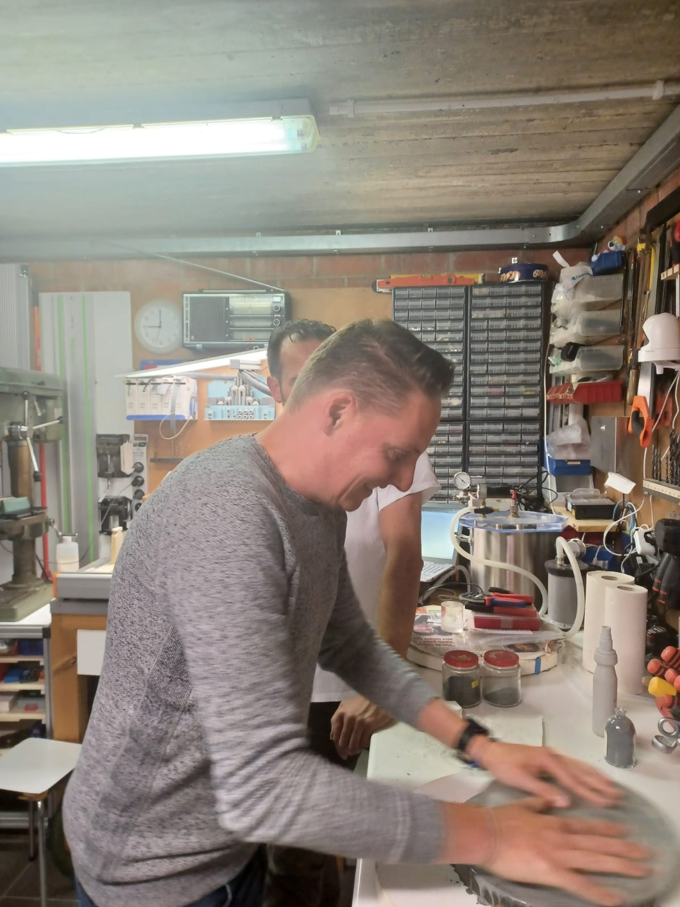

# Het begin

Haast heb ik nooit gehad met de start van de bouw van de dobson, of sterker nog, het slijpprocess van de spiegel. Ik heb het redelijk druk en er is geen haast bij. Yigal en ik hebben ondertussen wel een aantal keer gesproken over het slijpen van spiegel en lenzen en er waren wat ons betreft drie opties. Bij Yigal thuis, maar bij gebrek aan ruimte was dat geen optie. Een andere optie was Almere bij Jan van Gastel. Dit is voor ons best een eindje weg en werd op de lange baan geschoven. De derde optie was bij Bram Goossens in Vorselaar, een klein plaatje ten zuid westen van Turnhout. Yigal had voor de zomermaanden al eens contact met Bram en er werd afgesproken om na de zomermaanden nog eens contact te zoeken. zo geschiede en er werd een eerste afspraak gemaakt op 21 oktober 2021.

Yigal en ik gingen dus op de afgesproken datum naar Bram in Vorselaar. Daar aangekomen was het meteen gezellig en stelde we elkaar even voor en wat onze plannen zijn. Na wat geklets liet ik de blank en alle andere spullen zien aan iedereen die er was. Naast Bram, Yigal en ik was er ook nog Johny en Rudy. De doos met alle spullen werd uitgepakt en eigenlijk zijn we daar begonnen.

Er werd gevraagd of er spanningen in het glas zitten. Spanningen heb je het liefst zo min mogelijk. Met een stukje gepolariseerd glas, zoals bijvoorbeeld een zonnebril of een polarisatiefilter voor een camera zijn prima bruikbaar. We bekeken de blank en kwamen tot de conclusie dat er geen spanningen in het glas zitten. Omdat ik niet wist hoe het eruit zou zien als er wel spanning in glas zit, werd een dekself van een kookpot tevoorschijn gehaald. Dan kan je duidelijk kleurverschil zien in het glas, de donkere stukken in het glas representateren de spanning in het glas.

Daarna gingen Bram en Johny aan de slag om een lade, of schuif zoals ze in Belgie zeggen, op te ruimen zodat daar mijn spulletjes in konden liggen. Er werd ook een bijpassende tool bij gezocht, anti slip matjes, een draaischijf om aan te kunnen werken, opeens ging alles snel. Naast het opruimen en klaarmaken van een werkplekje kwam Johny met een soort van schuursponsje maar ipv een een schuur onderkant was het diamant om te kunnen schuren, zoals je bij een slijptol of boor ook wel eens ziet. Met dit "sponsje" hebben we de ruwe randjes van de blank gehaald onder een langzaam lopende waterkraan. Dit schuren duurde niet zo lang omdat de kantjes al afgeschuind zijn.

Na het schuren van de randjes zijn we gaan bepalen welke kant de onderkant en welke kant de spiegelkant gaat worden van de blank. Dit hebben we gedaan met poeder 320 door de blank aan beide kanten te gaan slijpen. In mijn geval zag je aan de ene kant een soort van vleugels aan twee overstaande zijkant. Aan de andere kant van de plank was dit patroon veel platter maar tevens een kwartslag gedraait. Dit komt vaker voor. De kant welke het meest vlak oogt word de onderkant van de spiegel. Dit vlak maken van de blank voordat we gaan uitdiepen met een grovere poeder moet ervoor zorgen dat er geen/minimaal astigmatisme in de spiegel komt. Een voorbereidende stap dus. Het is belangrijk om de achterkant vlak te maken zodat de druk dus later overal gelijk is. Het is tevens niet mogelijk om astigmatisme te corrigeren omdat dat voor elke spiegel anders is.

Het slijpen an sich werkt behoorlijk therapeutisch. Je krijgt een bepaalde rust in je hoofd en het is leuk om te doen. Wat me opviel is dat je redelijk snel slijppoeder opnieuw moet toevoegen met wat water omdat het slijppoeder snel "op" is. Het is heel veel op gevoel. Belangrijke zaken zijn dat je die blank niet onder een hoek van de tool afhaald, dit omdat het water de twee oppervlakten aan elkaar laat zuigen en er dan dus een druk ontstaat welke je niet wil hebben, we willen geen spanningen introduceren! Ook hebben we gemeten of er vooruitgang is met het vlak maken van de achterkant en dat was het geval. Het vasthouden van de blank is ook nog een dingetje. Je wilt niet met platte handen de blank vasthouden, dit is omdat je handen warm zijn en warmte introduceert spanningen. Beter houd je met slechts je vingers de rand van de blank vast. Nog beter zou een tool zijn waarin de blank zit zodat er helemaal geen warmteoverdracht plaats kan vinden.

Ook hebben we nog een kleine potlood test gedaan. Je kan dan goed zien waar er wel en geen contact met de blank en de tool is. Het blijkt dat de tool ergens een kleine afhang heeft. Dit geeft niks en zal uiteindelijk vanzelf oplossen door te blijven slijpen.

Uiteindelijk hebben we effectief een uurtje gewerkt om de achterkant vlak te maken. De twee helften hebben we gemarkeerd met een kruis zodat we weten welke bij elkaar horen. Na het slijpen werd er opgeruimt. Slijpen is een behoorlijk smerig klusje omdat er "veel" water bij komt kijken zodat het goed blijft glijden en dat in combinatie met het slijppoeder word het een soort van modderige bende. Schoonmaken is natuurlijk heel belangrijk. Wanneer we naar steeds fijnere poeders gaan wil je geen grove poeders ergens tussen hebben. Dit gaat voor krassen zorgen en dan zul je dus weer een stap terug moeten doen. Volgende week donderdag is het plan om terug te gaan naar Vorselaar om verder te werken om de achterkant vlak te maken.

